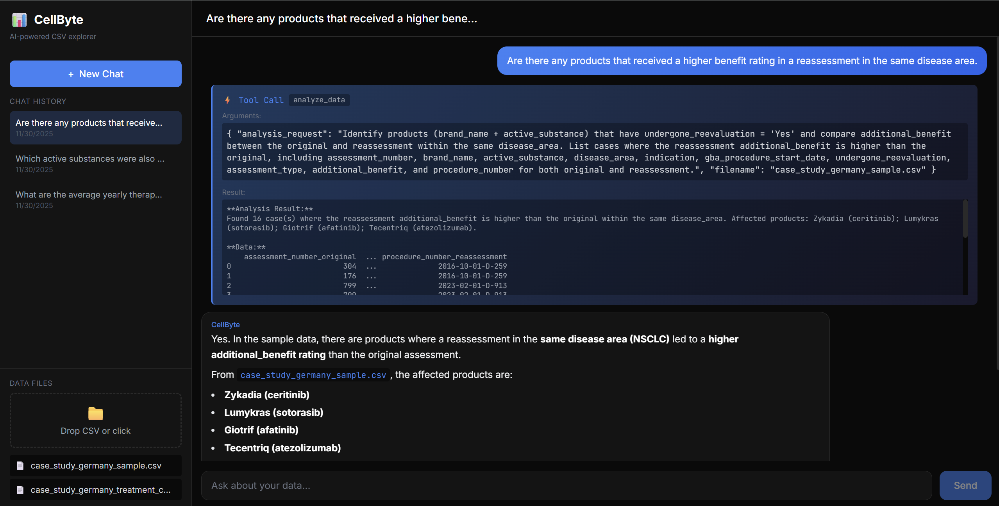

# CellByte Chat

A conversational AI chatbot that enables natural language interaction with CSV data using RAG (Retrieval-Augmented Generation) and specialized LLM tools.

---

## Architecture Overview

```
┌─────────────────────────────────────────────────────────────────────────┐
│                              USER INTERFACE                             │
│                            (Next.js Frontend)                           │
└─────────────────────────────────────────────────────────────────────────┘
                                     │
                                     ▼
┌─────────────────────────────────────────────────────────────────────────┐
│                         PARENT AGENT (LangGraph)                        │
│                                                                         │
│  Orchestrates all tools, maintains conversation state, routes queries   │
└─────────────────────────────────────────────────────────────────────────┘
          │                    │                    │                
          ▼                    ▼                    ▼                
    ┌──────────┐        ┌──────────┐        ┌──────────┐      ┌──────────┐
    │ RAG Tool │        │ Plotter  │        │Analytics │      │~~Web~~   │
    │ (Search) │        │   Tool   │        │   Tool   │      │~~Search~~│
    └──────────┘        └──────────┘        └──────────┘      └──────────┘
         ✅                  ✅                  ✅               🚫 TODO
```

---

## Quick Start

### Prerequisites

- Python 3.11+
- Node.js 20+
- OpenAI API Key

### Option 1: Run Locally (Development)

```bash
# Clone the repository
git clone <repo-url>
cd cellbyte_chat

# Create .env file
echo "OPENAI_API_KEY=your-key-here" > .env

# Backend setup
pip install -r requirements.txt
cd backend
uvicorn api:app --reload --port 8000

# Frontend setup (new terminal)
cd frontend
npm install
npm run dev
```

Access:
- Frontend: http://localhost:3000
- Backend API: http://localhost:8000
- API Docs: http://localhost:8000/docs

### Option 2: Run with Docker (Production)

```bash
# Clone and setup
git clone <repo-url>
cd cellbyte_chat

# Create .env file
echo "OPENAI_API_KEY=your-key-here" > .env

# Build and run
docker-compose up --build

# Or run in background
docker-compose up -d --build
```

Access:
- Frontend: http://localhost:3000
- Backend API: http://localhost:8000

Data persists in Docker volumes:
- `cellbyte_database` - FAISS index and file metadata
- `cellbyte_history` - Chat history
- `cellbyte_logs` - Application logs

---

## Features

### 1. CSV Ingestion & RAG Search

Upload CSV/TSV/Excel files. The system automatically:
- Generates LLM-powered descriptions
- Creates FAISS vector embeddings
- Extracts metadata (columns, types, statistics)

### 2. Visualization (Plotter Tool)

Ask for charts in natural language:
- "Show me a pie chart of additional benefit distribution"
- "Create a box plot of yearly costs by brand"


### 3. Analytics (Analyze Tool)

Ask for statistics and calculations:
- "What is the median yearly therapy cost?"
- "Calculate correlation between price and patient population"
- "Find all active substances that appear in comparative therapies"



---

## Tool Flows

### RAG Search Tool Flow

```
User Query: "Find drugs with major additional benefit"
    │
    ▼
┌─────────────────────────────┐
│       Parent Agent          │
│  (Decides to use RAG tool)  │
└─────────────────────────────┘
    │
    ▼
┌─────────────────────────────┐
│      FAISS Vector Store     │
│   Semantic similarity search │
└─────────────────────────────┘
    │
    ▼
Returns top-k matching rows
    │
    ▼
Agent summarizes findings for user
```

### Plotter Tool Flow

```
User Query: "Create a pie chart of benefit distribution"
    │
    ▼
┌─────────────────────────────┐
│       Parent Agent          │
│ (Decides to use Plot tool)  │
└─────────────────────────────┘
    │
    ├─► [Plot Request + Dataset Context]
    │
    ▼
┌─────────────────────────────┐
│   Plot LLM (Non-Agentic)    │
│   Generates Plotly code     │
└─────────────────────────────┘
    │
    ▼
┌─────────────────────────────┐
│   Code Execution (exec)     │
│   Runs generated Python     │
└─────────────────────────────┘
    │
    ├─► Success? Return HTML
    │
    ├─► Error? Feed back to LLM (retry up to 3x)
    │
    ▼
┌─────────────────────────────┐
│      User Interface         │
│  Renders interactive chart  │
└─────────────────────────────┘
```

### Analytics Tool Flow

```
User Query: "What is the median yearly therapy cost?"
    │
    ▼
┌─────────────────────────────┐
│       Parent Agent          │
│(Decides to use Analyze tool)│
└─────────────────────────────┘
    │
    ├─► [Analytics Request + Dataset Context]
    │
    ▼
┌─────────────────────────────┐
│ Analytics LLM (Non-Agentic) │
│ Generates pandas/scipy code │
└─────────────────────────────┘
    │
    ▼
┌─────────────────────────────┐
│   Code Execution (exec)     │
│   Available: pd, np, scipy, │
│   sklearn, re               │
└─────────────────────────────┘
    │
    ├─► Success? Return results dict
    │
    ├─► Error? Feed back to LLM (retry up to 3x)
    │
    ▼
┌─────────────────────────────┐
│       Parent Agent          │
│  Formats results for user   │
└─────────────────────────────┘
```

> ⚠️ **Key Principle**: LLMs DO NOT perform numerical calculations directly. All computations are delegated to proper libraries (Pandas, NumPy, SciPy). The LLM's role is purely code generation.

---

## Tech Stack

| Component | Technology |
|-----------|------------|
| **Agent Framework** | LangChain + LangGraph |
| **LLM** | OpenAI GPT-4o / GPT-5.1 |
| **Embeddings** | OpenAI text-embedding-3-large |
| **Vector Store** | FAISS |
| **Backend** | FastAPI + Uvicorn |
| **Frontend** | Next.js 14 + React |
| **Visualization** | Plotly |
| **Analytics** | Pandas, NumPy, SciPy, scikit-learn |
| **Containerization** | Docker + Docker Compose |

---

## API Endpoints

| Method | Endpoint | Description |
|--------|----------|-------------|
| `GET` | `/healthz` | Health check |
| `POST` | `/files/ingest` | Upload and ingest a CSV file |
| `GET` | `/files` | List all ingested files |
| `DELETE` | `/files/{filename}` | Delete a file |
| `POST` | `/chat` | Send message to agent |
| `POST` | `/chat/refresh` | Refresh agent metadata |
| `GET` | `/history` | List all chat sessions |
| `GET` | `/history/{id}` | Get specific chat history |
| `PUT` | `/history/{id}` | Update chat history |
| `DELETE` | `/history/{id}` | Delete chat history |

---

## Assumptions

### LLM Role Separation

| Component | Type | Responsibility |
|-----------|------|----------------|
| Parent Agent | Agentic (LangGraph) | Orchestration, routing, conversation |
| CSV Ingestion | Non-Agentic | Vectorstore + metadata generation |
| Plot LLM | Non-Agentic | Visualization code generation |
| Analytics LLM | Non-Agentic | Statistical code generation |

### Design Principles

1. **LLMs don't calculate** - All numerical computations are delegated to Python libraries (Pandas, NumPy, SciPy). LLMs only generate code.

2. **Non-agentic sub-LLMs** - Plotter and Analytics tools use single-shot LLM calls (not agents) for:
   - Predictability: No recursive tool calls
   - Performance: Lower latency
   - Cost efficiency: Fewer tokens

3. **Retry with feedback** - When generated code fails, the error is fed back to the LLM to fix (up to 3 attempts).

4. **Data stays structured** - CSVs are passed as DataFrames, not raw text.

5. **HTML for visualizations** - Plotly charts are returned as embeddable HTML.

---

## Potential Improvements

### Short-term

- [ ] Add web search tool for external knowledge augmentation
- [ ] Support more file formats (PDF tables, DOCX)
- [ ] Add export functionality (download charts, reports)
- [ ] Improve error messages shown to users
- [ ] Add streaming responses for better UX

### Medium-term

- [ ] Multi-file analysis (JOIN across CSVs)
- [ ] Save and share visualizations
- [ ] User authentication and multi-tenancy
- [ ] Custom prompt templates per use case
- [ ] Caching for repeated queries

### Long-term

- [ ] Fine-tuned models for domain-specific analysis
- [ ] Real-time data connections (databases, APIs)
- [ ] Collaborative features (shared workspaces)
- [ ] Plugin system for custom tools

---

## Unclear Requirements / Open Questions

### Document Transformation

**Question**: Should the system support document format conversion?

| Option | Description | Example |
|--------|-------------|---------|
| **Output transformation** | Convert LLM outputs to different formats | "Export this as PDF" |
| **Input parsing** | Parse non-CSV docs into analyzable structure | Upload PDF with tables → extract to CSV |

### Multi-Document Analysis

- Should users be able to JOIN data across multiple CSVs?
- How to handle conflicting column names?
- What's the UX for specifying relationships?

### Non-CSV Documents

| Category | Current Support | Future? |
|----------|-----------------|---------|
| CSV/TSV | ✅ Full support | - |
| Excel (.xlsx, .xls) | ✅ Full support | - |
| PDF with tables | ❌ | Marker integration |
| Word documents | ❌ | Marker integration |
| Images with tables | ❌ | OCR + Marker |

---

## Project Structure

```
cellbyte_chat/
├── backend/
│   ├── api.py                    # FastAPI endpoints
│   └── src/
│       ├── agent.py              # LangGraph agent
│       ├── general_utils/        # Shared utilities
│       │   ├── logger.py
│       │   └── file_utils.py
│       └── llm_utils/            # LLM-specific code
│           ├── csv_ingestion.py  # File ingestion & FAISS
│           ├── plotting_utils.py # Chart generation
│           ├── analytics_utils.py# Statistical analysis
│           └── tools.py          # Agent tools
├── frontend/
│   ├── app/                      # Next.js pages
│   ├── components/               # React components
│   └── lib/                      # API client & types
├── database/                     # FAISS index & metadata
├── history/                      # Chat history JSON files
├── Dockerfile
├── docker-compose.yml
└── requirements.txt
```

